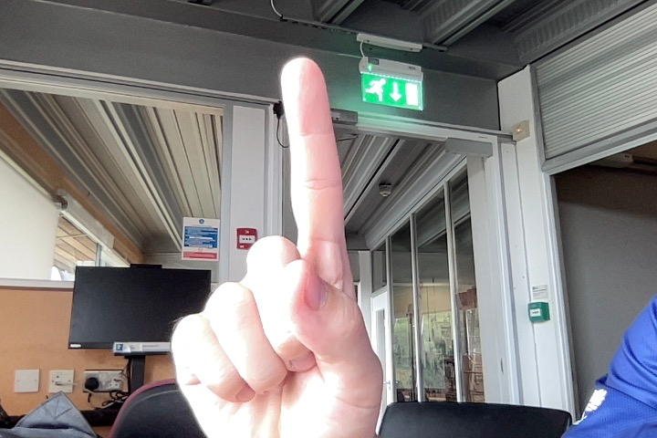
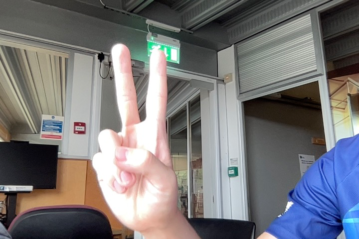
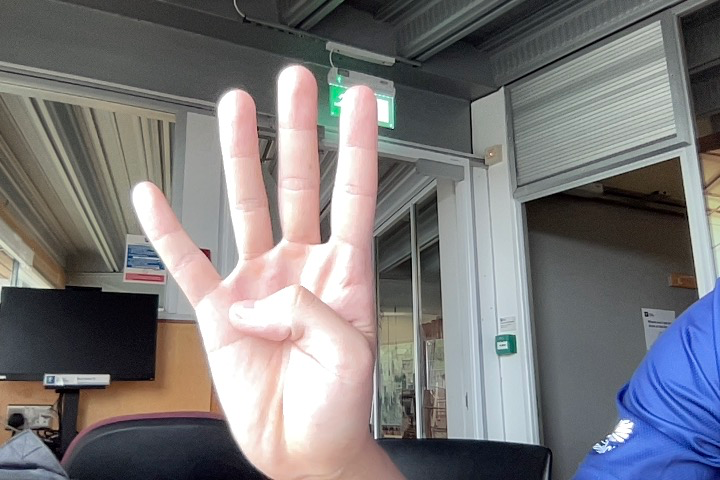
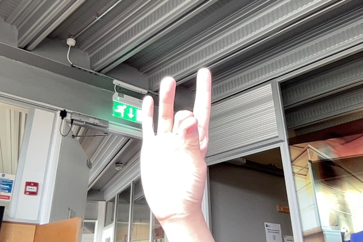
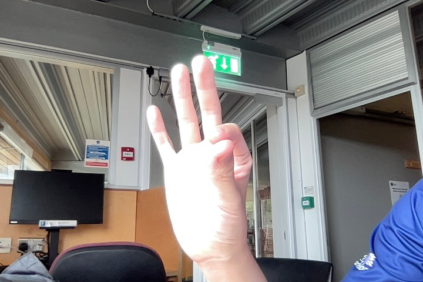
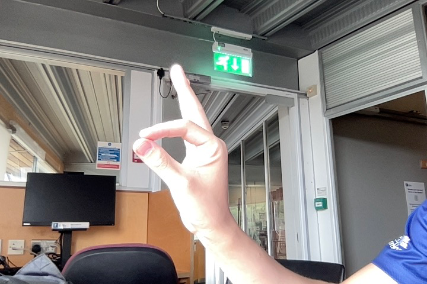
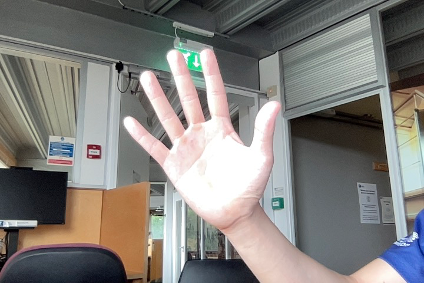
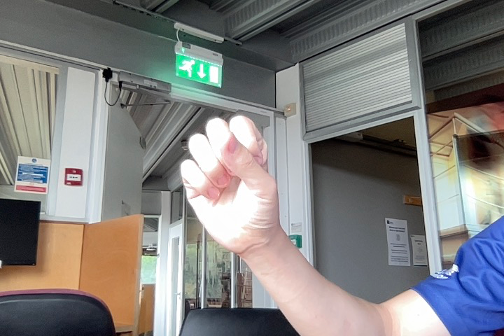
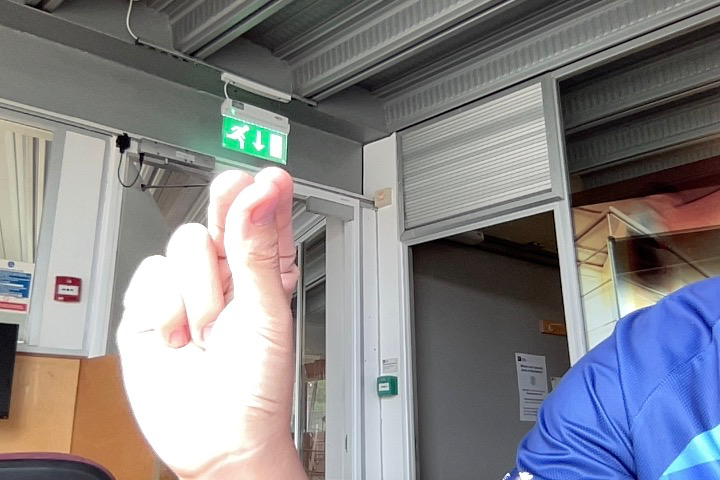
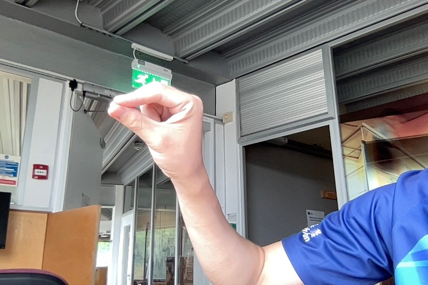

First part is the gestures, it will be trained and recognized by a single picture. The second part is the commands, some of the command is a single gesture, some of them is multiple combined together.

1. One finger
    
    
2. Two fingers
    
    
3. Four fingers

    
4. Thumb and middle finger touched

5. Thumb and index finger touched

    
6. Hands open

    
7. Hands close
    
    
8. Thumb, index finger, middle finger closed
    

    

The commands:

1. Move the cursor. Gesture 1
2. Drag, scroll, Gesture 2
3. Shift through tabs, Gesture 3, moving left and right
4. Click, Gesture 4
5. Release the click, Gesture 4 → Gesture 5
6. Zoom in, Gesture 6 → Gesture 5
7. Zoom out, Gesture 5 → Gesture 6
8. Right click, Gesture 4
9. Hand write to input texts, Gesture 7 and move the hands

Users can use these basic commands to finish some complex operations

- App management
    - switch tabs and apps, gesture 3, moving left and right
    - show all opened apps, gesture 3 swipe up
- Window management
    - Move window, move the cursor to the bar using gesture 1, and hold gesture 2 to move
    - Resize window, same as zoom in/out, transition between gesture 6 and 7 to zoom in and out
    - Minimize the window, gesture 3 to swipe down
- Text input & editing
    - Type, use hand writing by gesture 8, or a floating keyboard and alternatively using gesture 1 and gesture 5
    - Select, use gesture 5 and hold and move
- System control
    - Right click in windows/ double finger click in MacOS, gesture 4

If there is a complex command need to be posed, user can use 2 hands posing different gesture to finish combined commands.