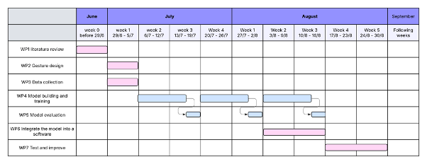
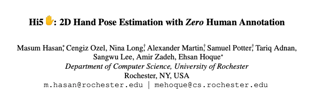
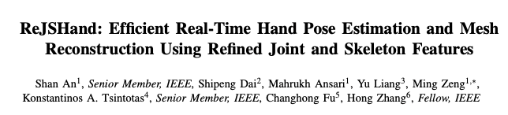
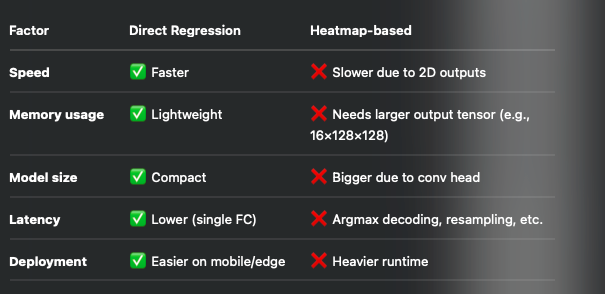
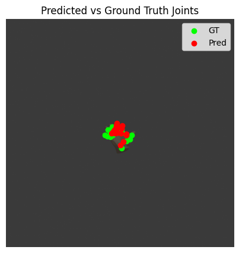
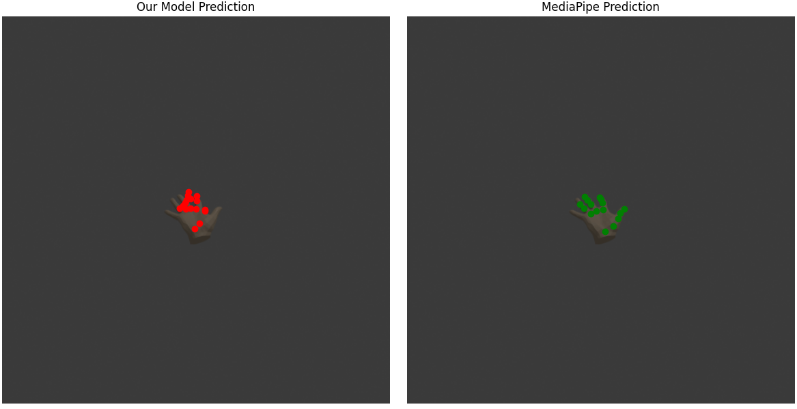
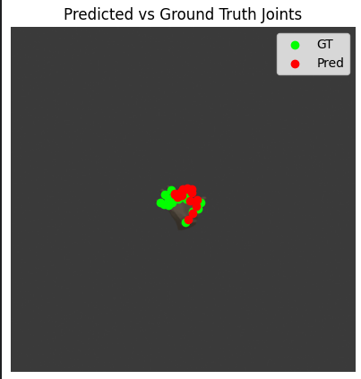
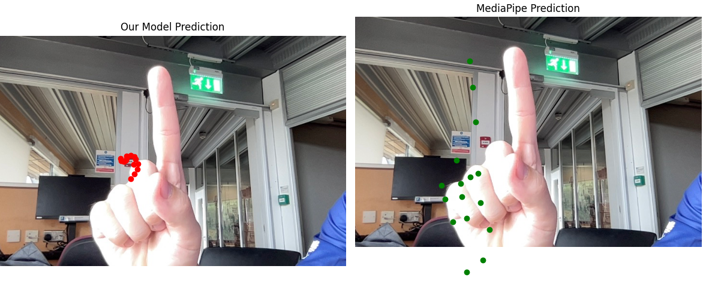
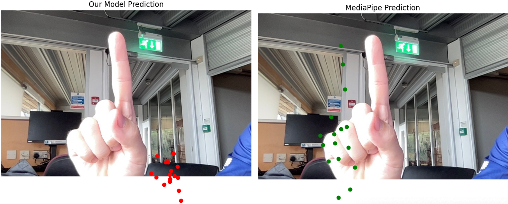

dissertation overleaf link: https://www.overleaf.com/project/686799ae3e3952171e3ca758

------------------------------------------
# week one, 1/7/2025 - 8/7/2025

1st meeting with professor 

project goal: the project will include an app that takes the hand gesture pictures as the input from a live stream. The app will convert the gesture into certain commands to control the smart device, just like using a keyboard and a cursor but touchless.

Upload every file into onedrive

supposed to do:
- [x]  research proposal
- [x]  methodology
- [x]  what kind of information i need from people
- [x] gesture design
- [ ] data collection

## 2/7/2025
- [x] research proposal
- [x] gesture design
- [x] start the writing on overleaf

gesture designed, should include distinguishable gestures, and use combination of gestures to cover every basic commands on OS.
writing on overleaf: https://www.overleaf.com/project/686799ae3e3952171e3ca758

## 3/7/2025
- [x] start the git repository, work log, documents
- [x] write the script of extracting frames from video
- [x] write the gesture design part into dissertation

git repo: https://github.com/AidanZhong/HandGestureRecog.git

## 4/7/2025
- [x] switch to correct template of dissertation using UoN's template
- [x] fill the correct ethic check form
- [x] fill the DMP(Data management plan)
- [ ] data collection

## 7/7/2025
- [x] data collected from 4 people

--------------------

# week two
- [ ] more literature review
- [ ] build the model
- [ ] methodology

write them down, which type is more demanded in industry in the future
1. explainable deep learning, maybe for medical imaging for example, the MRIs, CTs, could be interpretable
2. More VR/AR/MR based technology based on CV. For example stress monitoring, simulation training
3. Maybe combine some of the SLAM technology and experience i had before

## data preprocessing
- [ ] extract frames from the video and store it, label it
- [ ] extract features/skeleton from images and store it in a csv

# week three
- [ ] read 3 papers about hand gesture recognition
- [ ] trying to train my own model to extract the finger skeleton from images (AT LEAST try with 2 methods)

### 18/7/2025

read paper 'https://arxiv.org/abs/2406.03599'
core idea: Automatically generate 583k RGB images of hands using a consumer PC. It does not need any manual label.
Pipeline:
- Render diverse hand poses with high-quality 3D models.
- Train a CNN on this synthetic dataset
- Use domain adaption techniques to close the gap between generated data and real-world data.

It outperform those trained on real data, especially under occlusion.

### 19/7/2025

read paper 'https://arxiv.org/abs/2503.05995'
core idea: Introduce an efficient, lightweight network that predicts 2D keypoints, 3D keypoints, and full hand mesh from a single RGB image

### 20/7/2025
Combine the idea of the two article, I got my thought. Since it only need to classify only 8 gestures and they differs from each other.

My pipline is this:

--------------------
RGB Image

↓

Skeleton Estimator (CNN → Heatmaps)

↓

Extract 2D landmarks from heatmaps ← ignore occluded joints

↓

Classifier (MLP / CNN / LSTM) on 2D landmarks

↓

One of 8 Gesture Classes

----------------------

What I learnt from the papers
From Hi5:
- Focus on 2D landmark prediction only (no 3D, no mesh)
- Dont need labeled real data
- If occluded, just output visible keypoints - no need to hallucinate

From ReJSHand:
- Use a lightweighted heatmap regression network to predict 2D keypoints
- No mesh head, just the heatmap head for 21 joints

### 21/7/2025
Module 1: Skeleton predictor
Shallow CNN produces heatmaps
- input: RGB image
- Output: 21 heatmaps
- Loss: MSE between predicted heatmaps and ground truth gaussians
set occluded joints to None, to avoid unnecessary calculation

Module 2: Gesture Classifier
Take the 2D joint coordinates (21 * 2 vector), and classify into 8 gestures
Loss: Cross entropy

#### I need synthetic dataset generator
Use Blender Python API, which is widely used in Hi5-style pipelines
Randomized:
- hand pose (joint angles)
- Camera, viewpoint
- Light condition, background

Output:
RGB images, with list of 21 2D joint coordinates

## week 3
- [ ] prove 8 gestures are enough by my model, when my model is working proficiently
- [ ] finish the most part before 22nd August

todo:
- [x] finish the 2D hand skeleton estimator
- [ ] train the classifier model

### 28/7/2025
produce and rendered the images, together with joint coordinates projected on the scene

trained the model with the data provided before, and not using a heatmap because:

## week 4
- [ ] add more real data as much as possible to train the model
- [ ] adjust the parameter
- [ ] train the classifier model

### 29/7/2025

-----------------------------
the training is:
Epoch [1/30] Loss: 0.017426 | PixelErr: 52.09px
Epoch [2/30] Loss: 0.000486 | PixelErr: 14.07px
Epoch [3/30] Loss: 0.000505 | PixelErr: 14.32px
Epoch [4/30] Loss: 0.000513 | PixelErr: 14.42px
Epoch [5/30] Loss: 0.000502 | PixelErr: 14.31px
Epoch [6/30] Loss: 0.000503 | PixelErr: 14.32px
Epoch [7/30] Loss: 0.000512 | PixelErr: 14.45px
Epoch [8/30] Loss: 0.000573 | PixelErr: 15.35px
Epoch [9/30] Loss: 0.000540 | PixelErr: 14.82px
Epoch [10/30] Loss: 0.000532 | PixelErr: 14.57px
Epoch [11/30] Loss: 0.000570 | PixelErr: 15.32px
Epoch [12/30] Loss: 0.000552 | PixelErr: 15.01px
Epoch [13/30] Loss: 0.000527 | PixelErr: 14.63px
Epoch [14/30] Loss: 0.000599 | PixelErr: 15.70px
Epoch [15/30] Loss: 0.000534 | PixelErr: 14.79px
Epoch [16/30] Loss: 0.000536 | PixelErr: 14.78px
Epoch [17/30] Loss: 0.000590 | PixelErr: 15.53px
Epoch [18/30] Loss: 0.000553 | PixelErr: 14.99px
Epoch [19/30] Loss: 0.000563 | PixelErr: 15.16px
Epoch [20/30] Loss: 0.000547 | PixelErr: 14.86px
Epoch [21/30] Loss: 0.000518 | PixelErr: 14.58px
Epoch [22/30] Loss: 0.000600 | PixelErr: 15.65px
Epoch [23/30] Loss: 0.000721 | PixelErr: 17.09px
Epoch [24/30] Loss: 0.000530 | PixelErr: 14.68px
Epoch [25/30] Loss: 0.000529 | PixelErr: 14.67px
Epoch [26/30] Loss: 0.000540 | PixelErr: 14.82px
Epoch [27/30] Loss: 0.000557 | PixelErr: 15.05px
Epoch [28/30] Loss: 0.000526 | PixelErr: 14.68px
Epoch [29/30] Loss: 0.000559 | PixelErr: 15.17px
Epoch [30/30] Loss: 0.000533 | PixelErr: 14.68px

and the result is like:

compare it to mediapipe:

It is obviously a underfitting, preditions collapse to center

-------------------------------------------
Fix:
1. add more layer to the CNN
2. use L1 loss instead of MSE

Second training:
Epoch [1/30] Loss: 0.064925 | PixelErr: 50.26px
average per-joint errors: [ 3.9973967 26.705473  27.248432  24.867817  23.510578  31.563313
 28.90828   16.655891   7.489602   2.437439  20.595049  24.107552
 23.574799   4.8416424 11.612806  14.282575 ]
Epoch [2/30] Loss: 0.022725 | PixelErr: 18.22px
Epoch [3/30] Loss: 0.020497 | PixelErr: 16.49px
Epoch [4/30] Loss: 0.019946 | PixelErr: 16.05px
Epoch [5/30] Loss: 0.019376 | PixelErr: 15.61px
Epoch [6/30] Loss: 0.019375 | PixelErr: 15.61px
average per-joint errors: [18.532616 18.13741  18.28887  16.75485  13.306751  9.479755  3.178226
 11.70709  17.754925 16.812092 15.542696 12.567462 12.140382 20.627869
 28.153027 22.073124]
Epoch [7/30] Loss: 0.020885 | PixelErr: 16.79px
Epoch [8/30] Loss: 0.019379 | PixelErr: 15.65px
Epoch [9/30] Loss: 0.020005 | PixelErr: 16.11px
Epoch [10/30] Loss: 0.018599 | PixelErr: 14.95px
Epoch [11/30] Loss: 0.019391 | PixelErr: 15.56px
average per-joint errors: [28.31903  21.965622 18.959606 19.26754  19.918459 21.574427 25.866482
 17.241495 16.252306 17.655918 17.346865 19.060806 26.459377 27.54717
 26.57983  24.667778]
Epoch [12/30] Loss: 0.019592 | PixelErr: 15.76px
Epoch [13/30] Loss: 0.018746 | PixelErr: 15.14px
Epoch [14/30] Loss: 0.019511 | PixelErr: 15.69px
Epoch [15/30] Loss: 0.018392 | PixelErr: 14.82px
Epoch [16/30] Loss: 0.020408 | PixelErr: 16.42px
average per-joint errors: [13.973732  11.844834   9.494566  15.128635  11.713075  12.615984
 15.752957  11.181747  14.080307  15.002577  12.833723  12.037804
 18.999287  14.6993065 15.73647   15.064739 ]
Epoch [17/30] Loss: 0.018517 | PixelErr: 14.90px
Epoch [18/30] Loss: 0.018476 | PixelErr: 14.90px
Epoch [19/30] Loss: 0.018527 | PixelErr: 14.83px
Epoch [20/30] Loss: 0.019110 | PixelErr: 15.45px
Epoch [21/30] Loss: 0.018215 | PixelErr: 14.74px
average per-joint errors: [ 9.254971  11.964071   9.864086   7.3815107  9.909962  10.759191
 15.726042   5.8388295  7.165771  10.764963   8.379828   9.714081
  4.067054   7.4406934  6.7068377  6.37258  ]
Epoch [22/30] Loss: 0.018761 | PixelErr: 15.10px
Epoch [23/30] Loss: 0.017809 | PixelErr: 14.41px
Epoch [24/30] Loss: 0.018313 | PixelErr: 14.79px
Epoch [25/30] Loss: 0.018570 | PixelErr: 14.92px
Epoch [26/30] Loss: 0.018200 | PixelErr: 14.67px
average per-joint errors: [14.801151  14.317309  16.65722   16.446587  13.913852  14.520954
 19.78686   15.5315075 15.74345   18.361156  12.739169  12.823032
 11.992813  13.350641  13.6831    14.8945465]
Epoch [27/30] Loss: 0.018703 | PixelErr: 15.10px
Epoch [28/30] Loss: 0.018193 | PixelErr: 14.65px
Epoch [29/30] Loss: 0.018362 | PixelErr: 14.83px
Epoch [30/30] Loss: 0.018284 | PixelErr: 14.74px

still bad

------------------------------
Fix:
1. decrease learning rate
2. try weight decay

it is still not working

Epoch [1/30] Loss: 0.354919 | PixelErr: 265.66px
average per-joint errors: [ 32.469425  22.57381   22.465988  22.731922  56.753418 127.85109
  29.650614  63.41272    6.906284  60.681427 240.09691   30.063156
  86.62981   82.15129  166.06998   42.985886]
Epoch [2/30] Loss: 0.027928 | PixelErr: 23.84px
Epoch [3/30] Loss: 0.017775 | PixelErr: 14.28px
Epoch [4/30] Loss: 0.017537 | PixelErr: 14.15px

### 30/7/2025

1. use k-fold cross validation to tune the hyperparameters

